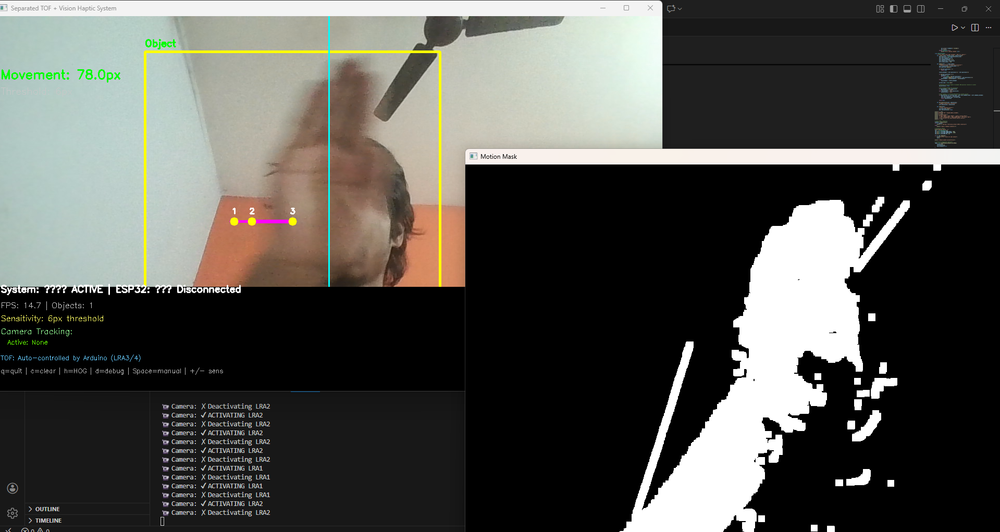
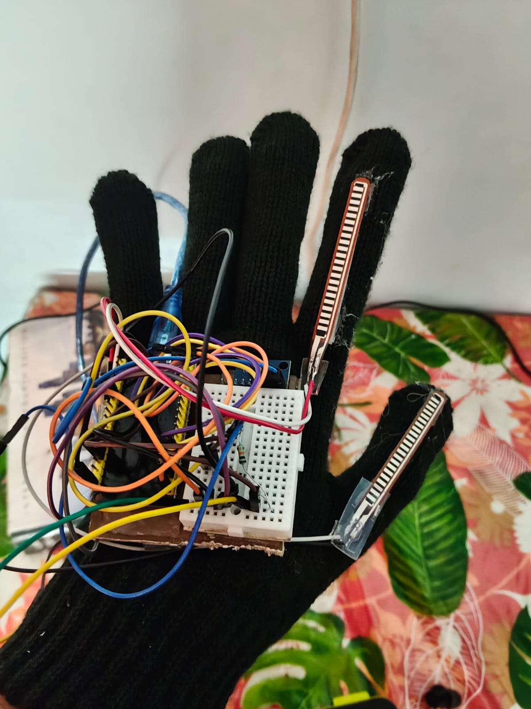

# Assistive Wearable System for Visually and Hearing-Impaired Individuals

> **Project Status: Active Prototype Integration** 
> We are currently working on a unified physical prototype that fully integrates both Phase 1 (Navigation) and Phase 2 (Gesture-to-Speech) into a single, cohesive system. This upcoming prototype scales our hardware significantly: upgrading the spatial feedback system to a **high-resolution 15-LRA haptic array** and fully utilizing **5 independent flex sensors** for complete, whole-hand sign language recognition.

This repository contains the hardware schematics, source code, and mobile application for a multi-modal assistive wearable system. Developed as a two-phase project, this system aims to bridge physical accessibility gaps by providing real-time spatial awareness for the visually impaired and a gesture-to-speech communication interface for the hearing and speech impaired.

---

##  Phase 1: Spatial Awareness & Navigation System

Phase 1 implements an intelligent, silent navigation node designed to provide spatial awareness through localized haptic feedback . The system operates on a state-machine architecture that remains completely idle until an environmental motion threshold is breached, drastically optimizing battery longevity .

###  Hardware Architecture & Pin Mapping
The system leverages an **ESP32 Microcontroller** interfaced with dedicated spatial sensors and dual **DRV8833 H-bridge motor drivers** to control four independent Linear Resonant Actuators (LRAs) .

| Component | Interface / Type | ESP32 Pin | Role / Function |
| :--- | :--- | :--- | :--- |
| **RCWL-0516** | mmWave Radar (Digital) | `GPIO 27` | Master system activation gate . |
| **VL53L1X** | Time-of-Flight (I2C) | `SDA: 21`, `SCL: 22` | High-precision depth and proximity tracking . |
| **LRA 1 (Left)** | Bidirectional PWM | `+ 18`, `- 5` | Triggers haptic pulse on left lateral movement . |
| **LRA 2 (Right)**| Bidirectional PWM | `+ 19`, `- 33` | Triggers haptic pulse on right lateral movement . |
| **LRA 3 (Front)**| Bidirectional PWM | `+ 25`, `- 32` | Continuous vibration for incoming obstacles . |
| **LRA 4 (Back)** | Bidirectional PWM | `+ 26`, `- 14` | Continuous vibration for retreating environments . |

> **Note:** Refer to `Phase_1_Navigation/ESP32_Firmware/Assets/Wiring_dig.png` for full schematics.

###  Software Implementation & Logic Flow
The software is divided into two distinct subsystems operating over an asynchronous **USB UART Serial link (115200 baud)** .

*   **Computer Vision Pipeline (Python + OpenCV):** Utilizes `cv2.createBackgroundSubtractorMOG2` to strip static environments and isolate structural motion contours . A Histogram of Oriented Gradients (`HOGDescriptor`) person detector differentiates human actors from random debris . Horizontal delta displacements exceeding a configurable pixel threshold trigger immediate non-blocking haptic pulse commands (`lra1` / `lra2`) to the ESP32 .
*   **Firmware Control Layer (ESP32 C++):** Loops natively on `checkMotion()` . If the mmWave pin reads `LOW`, all peripherals and motors are completely shut down . When active, `processTOFDistance()` evaluates real-time millimeter arrays every 300ms . If the spatial derivative is `< -100mm`, LRA 3 is driven; if `> 100mm`, LRA 4 is engaged .



---

##  Phase 2: Gesture-to-Speech Smart Glove

Phase 2 shifts focus to expressive communication, translating physical hand macro and micro-movements into spoken audio . The wearable glove utilizes sensor fusion to map joint flexion and 3D spatial orientation into a distinct vocabulary set, transmitted over Bluetooth to a mobile application .

###  Hardware Architecture & Pin Mapping
The glove's central processing unit is an **ESP32** utilizing `BluetoothSerial` (broadcasting as "GestureGlove_Pro") to communicate with the host Android device . 

| Component | Interface / Type | ESP32 Pin | Role / Function |
| :--- | :--- | :--- | :--- |
| **Flex Sensor 1** | Analog | `GPIO 34` | Tracks thumb joint flexion . |
| **Flex Sensor 2** | Analog | `GPIO 35` | Tracks index finger flexion . |
| **MPU6050** | IMU (I2C at `0x68`) | `SDA: 21`, `SCL: 22` | Captures 3D spatial orientation (Pitch/Roll) via G-force calculations . |

> **Note:** Refer to the images in the `Phase_2_Gesture_Glove/` directory for physical breadboard mounting.

###  Software Implementation & Logic Flow
The firmware is written in C++ and focuses on real-time data fusion, debouncing, and user calibration . 

*   **Smart Calibration Routine:** The system features a 5-step calibration sequence (Neutral, Flex Closed, Tilt Right, Tilt Up) that calculates perfect midpoint thresholds for the user's specific hand size and stores them permanently using the ESP32 `Preferences` library .
*   **Sensor Fusion Logic:** Gestures are evaluated by combining binary flex states (Bent/Open) with IMU Pitch/Roll thresholds . Pitching the hand "Up" while the thumb is "Bent" triggers *"What is in dinner today?"*, whereas closing both fingers triggers a priority *"Help"* command .
*   **Anti-Spam Cooldown:** To ensure natural speech pacing on the receiving Android app, a strict `2200ms` non-blocking timer (`millis()`) prevents the continuous broadcasting of identical gestures . 





##  Acknowledgements & Team

*   **Project Mentor:** Dr. Amit Ranjan Azad
*   **Team Members:** 
    *   Mrutyunjay Lodhi
    *   Nikhil Tiwari
    *   Kripa Shankar
    *   N. Rana Prathap Rathod

---

## 📁 Repository Structure

```text
└── 📁Assistive-Wearable-System
    ├── 📁Phase_1_Navigation
    │   ├── 📁ESP32_Firmware
    │   │   ├── 📁Assets
    │   │   │   └── Wiring_dig.png
    │   │   └── esp_final_p1.ino.ino
    │   ├── 📁Python_CV
    │   │   └── cam_esp_final_p1.py
    │   ├── img1.png
    │   ├── img2.png
    │   └── img3.jpg
    ├── 📁Phase_2_Gesture_Glove
    │   ├── 📁Android_App
    │   │   └── GestureGlove.apk
    │   ├── 📁ESP_32_Firmware
    │   │   └── Phase_2_Code.ino
    │   ├── img1.jpeg
    │   ├── img2.png
    │   └── img3.png
    ├── LICENSE
    └── README.md